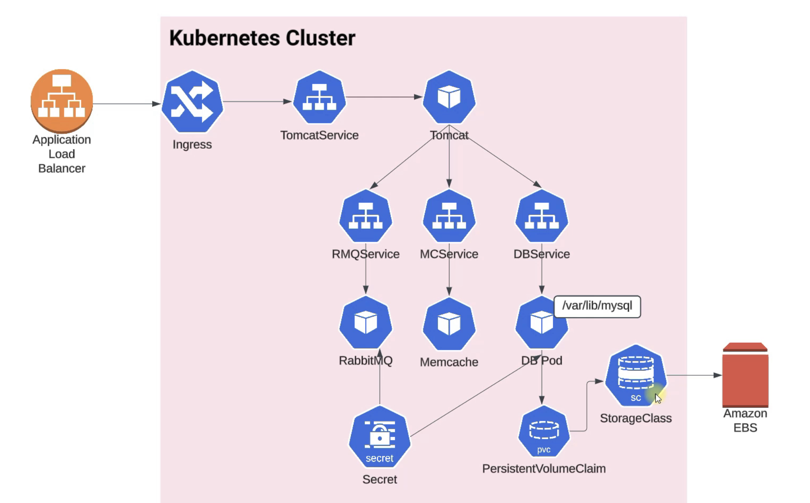
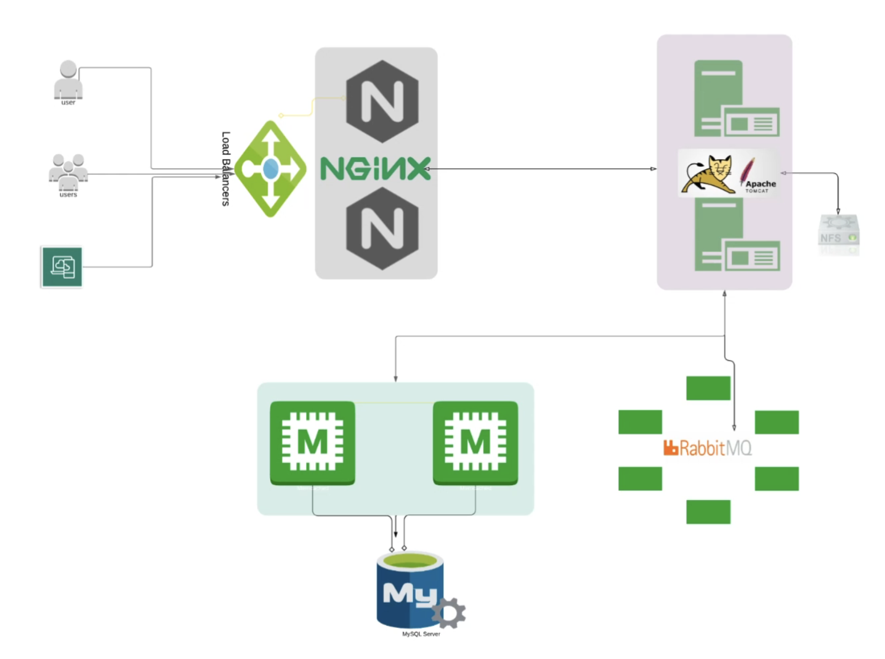
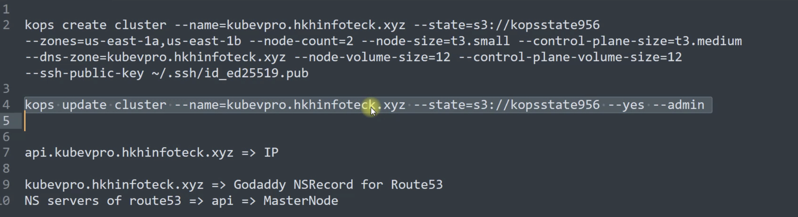

# vProfile Project: Kubernetes Deployment on AWS(kOps)
> Deploy the **vProfile web application** (Nginx, Tomcat, RabbitMQ, Memcached, MySQL) on a
scalable, production-grade **Kubernetes cluster** managed via **kOps and AWS EC2**, using
**NGINX Ingress** for external access.

- Kubernetes Logical Architecture


---

## 🧩 **Architecture Summary**

- 🧱 **Microservices Architecture:**  
  Each service (**Tomcat**, **MySQL**, **RabbitMQ**, **Memcached**) runs in a **separate pod and deployment** ensuring **isolation, scalability, and fault tolerance**.

- 🔄 **Internal Communication:**  
  Services communicate through **ClusterIP** networking for efficient intra-cluster routing.

- 💾 **Persistent Storage:**  
  **MySQL** is backed by an **AWS EBS volume**, provisioned dynamically via **PersistentVolumeClaim (PVC)** and a **StorageClass**.

- 🔐 **Secure Configuration:**  
  Application credentials and database passwords are managed through **Kubernetes Secrets** for secure runtime injection.

- 🌍 **External Access:**  
  **NGINX Ingress Controller** integrated with **AWS Application Load Balancer (ALB)** exposes the application to the internet with DNS-based routing.

---


## ■ Diagrams
- vProfile Application Architecture


---

## 🧭 **Step-by-Step Workflow**


### 🖥️ **1️⃣ Launch AWS EC2 Instance (Admin / Jump Box)**
- Start a clean **Amazon Linux 2** or **Ubuntu EC2** instance in your desired region.  
- Use it as your **Admin Node** for cluster management.  
- 🔐 **SSH** into the instance securely using your private key.
```bash
ssh -i <key>.pem ec2-user@<instance-public-ip>
```

### ⚙️ **2️⃣ Install Required Tools**
Set up the essential Kubernetes and AWS management tools:

- ☁️ **AWS CLI** – Configure access to your AWS account using `aws configure`.  
- 🔑 **IAM Permissions** – Ensure the EC2 instance role has permissions for:
  - EC2
  - S3
  - VPC
  - Route53  
- 🧩 **kubectl** – CLI tool to manage your Kubernetes cluster.  
- 🛠️ **kOps** – Kubernetes Operations tool to create and manage clusters on AWS.

```bash
sudo apt update
sudo apt install -y python3-pip
pip3 install awscli --upgrade --user

# kubectl
curl -LO "https://storage.googleapis.com/kubernetes-release/release/$(curl -s https://storage.googleapis.com/kubernetes-release/release/stable.txt)/bin/linux/amd64/kubectl"
chmod +x kubectl
sudo mv kubectl /usr/local/bin/

# kOps
curl -LO https://github.com/kubernetes/kops/releases/download/v1.25.3/kops-linux-amd64
chmod +x kops-linux-amd64
sudo mv kops-linux-amd64 /usr/local/bin/kops
```


### ☸️ **3️⃣ Use kOps to Create Your Kubernetes Cluster**

**🧰 Preparation Steps:**
- 🪣 **Create an S3 Bucket** – Acts as the **state store** for kOps.  
- 🔐 **Generate an SSH Key Pair** – For secure access to cluster nodes.  
- 🌍 **Set Up Route53 Hosted Zone** – For DNS-based access and cluster identification.

**⚡ Cluster Setup Summary:**
- 🚀 Provision a **Kubernetes cluster** with:
  - **1 Master Node**
  - **2 Worker Nodes**  
- 🌿 kOps automatically configures networking, subnets, and IAM roles.
```bash
kops create cluster \
  --name=kubevpro.hhkinfoteck.xyz \
  --state=s3://kopsstate956 \
  --zones=us-east-1a,us-east-1b \
  --node-count=2 \
  --node-size=t3.small \
  --control-plane-size=t3.medium \
  --dns-zone=kubevpro.hhkinfoteck.xyz \
  --node-volume-size=12 \
  --control-plane-volume-size=12 \
  --ssh-public-key ~/.ssh/id_ed25519.pub

kops update cluster \
  --name=kubevpro.hhkinfoteck.xyz \
  --state=s3://kopsstate956 \
  --yes --admin

kubectl get nodes
```


### 🌐 **4️⃣ Set Up DNS for Cluster Access**
- 🔍 Retrieve the **API / Public Endpoint** of your cluster from **Route53** or the **AWS Console**.  
- 🌎 Point your **domain name** (e.g., `vprofile.hhkinfoteck.xyz`) to the **AWS ALB endpoint** using your **GoDaddy DNS records**.  
- 🧭 This enables smooth external access to your Kubernetes-hosted application through a custom domain.




### 🧱 **5️⃣ Install NGINX Ingress Controller**
- 🪶 Create a dedicated namespace called `ingress-nginx`.  
- 🚦 Deploy the **AWS-optimized NGINX Ingress Controller**, which routes external traffic to internal services.  
- ✅ Once deployed, verify that **Ingress pods** and **services** are up and running inside the `ingress-nginx` namespace.  

> 🔁 The Ingress Controller integrates with AWS ALB to provide **secure**, **load-balanced**, and **scalable** HTTP/HTTPS traffic routing.

```bash
kubectl create namespace ingress-nginx
kubectl apply -n ingress-nginx -f https://raw.githubusercontent.com/kubernetes/ingress-nginx/controller-v1.1.3/deploy/static/provider/aws/deploy.yaml
kubectl get all -n ingress-nginx
```


### 💾 **6️⃣ Clone vProfile Source and Prepare Manifests**
- 📥 Clone the **vProfile** source code repository to your local system or admin EC2 instance.  
- 📂 Navigate to the **`manifests/`** directory to review and apply the Kubernetes YAML definitions.  
- 🧾 These manifests define:
  - **Deployments** for each component (Tomcat, MySQL, RabbitMQ, Memcached)
  - **Services** (ClusterIP / NodePort)
  - **PersistentVolumeClaims**
  - **Secrets** and **ConfigMaps**
  - **Ingress Rules** for routing

> 🖼️ *(Reference screenshots or diagrams may be included here to visualize manifest file organization.)*

```bash
git clone https://github.com/<your-org>/vprofile-k8s.git
cd vprofile-k8s/kubedefs
```

```bash
appdeploy.yaml
appservice.yaml
dbdeploy.yaml
dbpvc.yaml
dbservice.yaml
mcdep.yaml
mcservice.yaml
rmqdeploy.yaml
rmqservice.yaml
secret.yaml
appingress.yaml
```

### 🚀 **7️⃣ Apply Kubernetes Manifests (Deploy the Application)**
- ⚡ Deploy all **vProfile components** (Tomcat, MySQL, RabbitMQ, Memcached, Nginx) by applying the manifest files.  
- 🧩 Kubernetes automatically creates the **pods**, **services**, **PVCs**, and **secrets** defined in your YAMLs.  
- 🔍 Verify deployment status to ensure every component is running and healthy.

> 🧠 Tip: Proper namespace and resource labeling help with monitoring and debugging.
```bash
kubectl create -f .
kubectl get all
kubectl get pvc
kubectl get secret
```


### 🌍 **8️⃣ Access the Application via DNS and Ingress**
- 🌐 The **NGINX Ingress Controller** provisions an **AWS Application Load Balancer (ALB)** to handle incoming traffic.  
- 🔁 The **Ingress resource** routes requests from the ALB to the **Tomcat service**, which serves the vProfile web frontend.  
- 🔎 Retrieve the **ALB hostname** and map it to your domain in **GoDaddy DNS records** for clean URL access.

```bash
kubectl get ingress
http://<your-domain>/welcome
```

---
## ■ Kubernetes Manifests Structure
| Component             | Purpose                            |
|-----------------------|------------------------------------|
| **Secrets**           | DB and RabbitMQ credentials        |
| **PVC + StorageClass**| MySQL persistence (EBS)            |
| **Deployments/Pods**  | Tomcat, MySQL, RabbitMQ, Memcached |
| **ClusterIP Services**| Internal communication             |
| **Ingress YAML**      | External routing (NGINX + ALB)     |
---
## ■ Troubleshooting & Validation
```bash
kubectl get nodes
kubectl get all
kubectl get pvc
kubectl describe ingress
```
---
## ■ Diagrams & Screenshots Reference
- Kubernetes Cluster Architecture → `Kubernetes-Cluster.jpg`- kOps Setup → `Pasted-Graphic-1.jpg`
- Ingress YAML → `appingress.yaml.jpg`
- App Access & Network Flow → `Pasted-Graphic-3.jpg`
- Manifest Directory Screenshot → (Terminal reference)
---
## ■ Summary
**vProfile Kubernetes deployment in AWS using kOps and NGINX Ingress Controller** ensures a
**scalable, robust, and secure orchestration** for modern containerized workloads.
This guide follows best practices for:
- Multi-tier app orchestration
- Persistent storage
- Secret management
- External accessibility